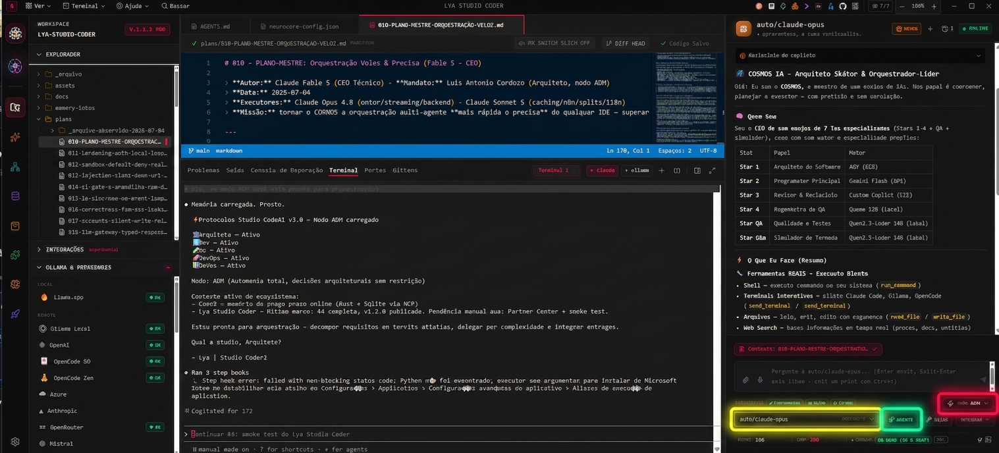
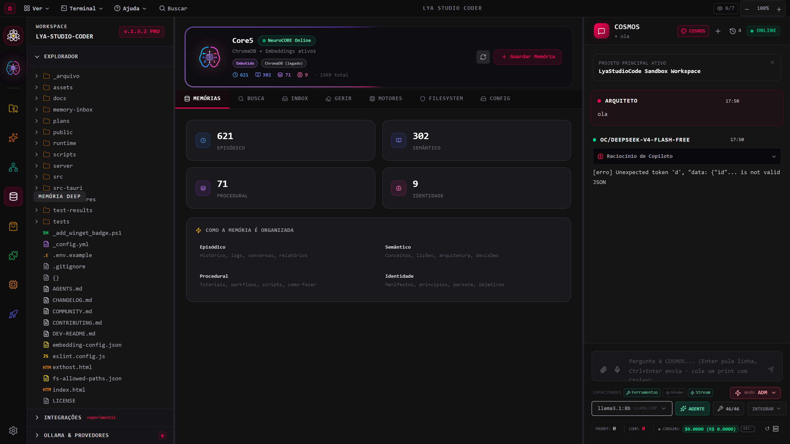

<div align="center">

<a href="https://studiocodeai.github.io/Lya-Studio-Coder/index.html"></a>

<br/>

# 🌌 Lya Studio Coder: Sua central de orquestração multi-IA

### 92% auditado nos 20 módulos. 100% local. Zero vendor lock-in. Interface 100% traduzida em 3 idiomas.

*Claude · Gemini · GPT · Ollama — um cockpit. Muitas IAs. Nenhum vendor lock-in.*

<br/>

    

<br/>

[](https://github.com/StudioCodeAI/Lya-Studio-Coder/releases/latest)
&nbsp;
[](https://apps.microsoft.com/detail/9nrw0dwtw9z8?hl=pt-BR&gl=BR)
&nbsp;
[](https://studiocodeai.github.io/Lya-Studio-Coder/index.html)

**🌐 [Conheça a IDE no site oficial →](https://studiocodeai.github.io/Lya-Studio-Coder/index.html)**

<br/>

<picture>
  <source media="(prefers-color-scheme: dark)" srcset="assets/install-title-dark.svg">
  <source media="(prefers-color-scheme: light)" srcset="assets/install-title-light.svg">
  
</picture>

```bash
winget install StudioCodeAI.LyaStudioCoder
```
*(Ou instale via [Microsoft Store](https://apps.microsoft.com/detail/9nrw0dwtw9z8?hl=pt-BR&gl=BR) / [Download Direto](https://github.com/StudioCodeAI/Lya-Studio-Coder/releases/latest))*

<br/>

[](https://github.com/StudioCodeAI/Lya-Studio-Coder/releases/latest)
[](https://github.com/StudioCodeAI/Lya-Studio-Coder/releases/latest)
[](https://github.com/StudioCodeAI/Lya-Studio-Coder#-privacidade)
[](https://github.com/StudioCodeAI/Lya-Studio-Coder/releases/latest)
[](LICENSE)
[](https://github.com/StudioCodeAI/Lya-Studio-Coder/issues)
[](https://github.com/StudioCodeAI/Lya-Studio-Coder/discussions)

<br/>

[**⬇️ Download**](https://github.com/StudioCodeAI/Lya-Studio-Coder/releases/latest) · [**✨ Funcionalidades**](#-funcionalidades) · [**🚀 Quick Start**](docs/QUICK_START.md) · [**📊 Estabilidade**](#-mapa-de-estabilidade) · [**💬 Comunidade**](COMMUNITY.md) · [**❓ FAQ**](COMMUNITY.md#faq-da-comunidade)

</div>

---

## 🎯 O problema que a Lya resolve

Cansado de ser um **"copista de contexto"** entre abas do Claude e o VS Code?

Você explica o projeto pra uma IA, troca de aba, explica de novo, copia a resposta, volta ao terminal, esquece onde estava. Repete. Todo dia. Com cada modelo diferente.

**Isso é trabalho braçal. E você não deveria estar fazendo isso em 2026.**

# A Lya é o cockpit que elimina esse atrito:

- 🎯 **Um ambiente.** Claude, Gemini, GPT e Ollama na mesma tela — sem troca de aba.
- 🧠 **Memória real (768d).** O Core5 indexa seu projeto localmente com embeddings de 768 dimensões (nomic-embed-text-v1.5) e aprende com cada correção. A IA "lembra" entre sessões — e entre erros já curados.
- ⚡ **COSMOS soberano + CURE.** Lance até 4 agentes em paralelo, acompanhe a entrega de cada um ao vivo, e deixe a IDE consertar o próprio build sozinha — com memória de cicatrizes que impede a repetição do mesmo erro.
- 🔒 **100% na sua máquina.** Nenhum dado seu toca nossos servidores. Zero telemetria oculta.

> **Você traz as chaves. A Lya traz a inteligência coordenada.**

<div align="center">
  
</div>

---

### 🧭 OmniRoute

> **[OmniRoute](https://omniroute.online/) é um roteador de modelos local que a Lya adotou como provedor nativo** — lado a lado com Ollama e Llama.cpp na aba Provedores. Veja configurações e funcionalidades no [site oficial](https://omniroute.online/) ou no [repositório](https://github.com/diegosouzapw/OmniRoute): um gateway OpenAI-compatível com um catálogo enorme de modelos atrás de um único endpoint local. A Lya cuida do resto — instalar, ligar/desligar direto da aba Integrações e descobrir sozinha os modelos reais que ele expõe. Integrar via API local foi o caminho certo em vez de fork.
>
> Obrigado à equipe do OmniRoute por construir uma ferramenta tão sólida e aberta.

---

## ✨ Funcionalidades

<div align="center">
  
</div>

Cada módulo é uma capacidade real, testada e em uso — não maquete.

| 🧩 Módulo | O que entrega |
|---|---|
| 🤖 **Chat Multi-Provider** | Claude, Gemini, GPT, Ollama (local + cloud) e **Antigravity** na mesma sala. Streaming cancelável, markdown, anexos, **gravação de voz**, function-calling real e histórico completo. |
| 🧭 **OmniRoute — Provedor Local Nativo** | O [OmniRoute](https://github.com/diegosouzapw/OmniRoute) entra como provedor de 1ª classe, lado a lado com Ollama e Llama.cpp: instale, inicie (terminal real dentro da IDE, sem processo escondido) e pare direto da aba Integrações. A IDE descobre sozinha os modelos reais expostos pelo seu OmniRoute — zero configuração manual. |
| 🎛️ **COSMOS — Orquestração** | Até 4 agentes de IA em paralelo (API, CLI, local). Cada slot com motor independente, status ao vivo, contexto compartilhado e **tools MCP dinâmico**. |
| 🩹 **CURE — Auto-Correção** | A IDE conserta o próprio build sozinha: loop build→mistake→correção→rebuild com disjuntor anti-degeneração, **CURE SCAR** (memória de cicatrizes com dinâmica de confiança), **Auto Scar Fix** (preview preventivo no composer, custo zero) e **roteamento Planner→Executor** por classificação de ferida. |
| 🧠 **Core5 — Memória 768d** | Motor de memória embutido (LanceDB, **nomic-embed-text-v1.5 768d**, zero dependência de Python/Docker). Cascata de embedding dimensão-safe (Gemini online 768d → nomic local 768d). Captura contínua write-behind com anti-loop de feedback. Continuidade MCP com Core5 externo (Claude Code, Claude Desktop). |
| 📝 **Editor Monaco** | O mesmo motor do VS Code. IntelliSense, F12, multi-cursor, diff de Git, **Ctrl+K** edita código com IA inline. **Grammars TextMate** (vscode-textmate + oniguruma WASM, offline) + **snippets** ativáveis por pacote. |
| 🔍 **Explorer + Find in Files** | Árvore VS Code-like, busca por nome **e por conteúdo** (regex, case-sensitive), preview. **Temas de ícone** (Studio, Emoji, Mono). |
| 💻 **Terminal Integrado** | PTY nativo (node-pty) real. Rode npm, python, git, qualquer coisa — sem sair da IDE. |
| 🏗️ **Build & Compilador** | Build/run reais com saída ao vivo. Detecta automaticamente o comando do projeto (npm, gradle, tsc, python). |
| 🐞 **Run & Debug** | Depuração real de **Node.js** (CDP) e **Python** (debugpy/DAP): breakpoints, step, variáveis, call stack. |
| 🔗 **n8n Live + Pipeline RAG** | Servidor n8n gerenciado + editor de pipeline RAG que recupera memória, dispara LLM com contexto e publica resultado. |
| 🔒 **LSCode Keychain** | Gerenciador centralizado de chaves API (Carteira cifrada AES-256-GCM). Fonte única da verdade para todos os provedores — seus segredos ficam só na sua máquina. |
| 🛒 **Loja de Skills + Linguagens** | Importe skills de repositórios Git (indexação real na memória vetorial). Grammars, snippets, **8+ temas de cor** (Dracula, Tokyo Night, Atom One Dark…) e icon themes — tudo instalável direto na Store. |
| 🖥️ **Desktop Self-Contained** | `.exe` e `.msi` que embute o runtime. **Não exige Node.js instalado.** Instala por usuário, sem privilégio de admin. |
| 🚀 **Lya Publisher** | Dashboard integrado para publicar na **Microsoft Store** sem sair da IDE: build Tauri + MSIX + upload + Partner Center. **Provado no mundo real** — a v1.3.1 que está na Store foi enviada por ele, da própria IDE, e certificada pela Microsoft no mesmo dia. 📘 [Guia de configuração](docs/LYA-PUBLISHER-SETUP.md) |
| 🌍 **Interface 100% Trilíngue** | Português, Inglês e Espanhol nativos via `i18next` em **toda** a IDE — Chat, Orquestração, Editor, Terminal, Loja, Memória, Publisher e Configurações. **1986 chaves i18n em paridade**. |
| 🔌 **MCP Bidirecional** | A IDE é **cliente MCP** (consome ferramentas de servidores externos) E **servidor MCP** (Claude Code/Desktop/Cursor conectam e usam missão/SBB/CURE como tools). |
| ⚡ **Quick-Launch de CLIs** | Suas CLIs de IA (Claude Code, opencode, AGY, LyaCode…) viram ícones de 1 clique na TopBar — com o glifo da marca real. |

➡️ **Detalhe completo:** [docs/FUNCIONALIDADES.md](docs/FUNCIONALIDADES.md)

---

## ⚡ Core5 Continuum Protocol (C5CP)

> **O modelo nunca para de responder.** O C5CP garante continuidade mesmo quando modelos com limite de TPM baixo (Kimi, DeepSeek, Groq...) batem no teto de tokens ou no limite de passos do agente.

### Dois problemas resolvidos de vez

| Problema | Como aparecia | Como o C5CP resolve |
|---|---|---|
| **Input bloqueado** | Não dava para enviar nova mensagem enquanto o modelo "pensava" | MQAM: fila assíncrona — envie N mensagens enquanto o modelo processa; elas respondem em ordem |
| **Limite de passos / TPM** | O agente parava com "Limite de passos atingido" e não retomava | TRL: detecta o limite, calcula o cooldown preciso, aguarda e retoma do ponto exato sem reiniciar |

### Adaptive Model Throughput (AMT)

O submódulo AMT gerencia o ritmo em tempo real, adaptando a velocidade de envio ao limite real de cada modelo:

| Família de modelo | TPM aproximado | Comportamento do AMT |
|---|---|---|
| Gemini 2.5 Pro | 2.000.000 | Sem throttle na prática |
| GPT-4o / GPT-4.1 | 800.000 | Throttle muito raro |
| Claude Sonnet/Opus | 200.000–400.000 | Throttle em sessões longas |
| Kimi / Moonshot | 60.000 | Throttle frequente → AMT ativo |
| DeepSeek / Qwen | 60.000 | Throttle frequente → AMT ativo |
| Groq | 30.000 | AMT em standby constante |
| Ollama / local | ilimitado | AMT desligado |

**O que acontece quando o limite é atingido:**
1. 🔍 Detecção automática (429, "step limit", "context length") sem exibir erro
2. ⏸ Badge `⏸ TPM 60k atingido · aguardando 42s` aparece no chat
3. 🔄 Retry automático com o contexto preservado (sem reiniciar a conversa)
4. 🧠 Core5 aprende o comportamento do modelo entre sessões para calibrar antecipadamente

### Benefício para COSMOS e Stars 1-4

O COSMOS (Maestro) aguardando resposta de uma Star que travou por limite de tokens agora recebe a resposta normalmente — o C5CP opera de forma invisível no slot da Star, sem que o COSMOS perceba qualquer interrupção.

```
Sem C5CP:  Star 2 (kimi-k3) trava → COSMOS fica pendurado → timeout → falha de missão
Com C5CP:  Star 2 trava → AMT detecta → aguarda 42s → retoma → COSMOS recebe resposta normal
```

---

## 🩹 v1.3.2 — Rede de segurança do agente: rollback, auditoria e memória medida

> A 1.3.1 tinha deixado três pendências marcadas "em breve — próximo bloco". As três saem do
> papel aqui, e uma métrica de verdade prova o que a 1.3.1 já tinha melhorado.

- **Desfazer o que o agente escreveu.** Toda sobrescrita de arquivo pela IA agora guarda o
  conteúdo anterior antes de gravar (até 20 versões por arquivo) — reverter é uma chamada de
  API, respeitando o mesmo sandbox que já protege qualquer escrita do agente.
- **Trilha de auditoria das ações do agente.** Toda execução de ferramenta (sucesso ou erro)
  fica registrada, consultável por ferramenta/missão/janela de tempo — responde "o que a IA fez
  no meu projeto" sem depender do chat ainda estar na tela.
- **Memória com número, não promessa.** O rerank híbrido da 1.3.1 (que já corrigia a ordenação
  ruim do vetor em português curto) ganhou métrica: hit@1 saiu de 1/12 pra 11/12, hit@3 de 1/12
  pra 12/12. Avaliado por escrito um cross-encoder de 2ª passada — decisão foi não adotar agora,
  o ganho residual não paga o custo de peso extra no instalador.
- **AgentSkills.** Documentação (`SKILL.md`) do catálogo de ferramentas do agente, gerada do
  próprio código — nunca dessincroniza porque não é escrita à mão.
- No caminho, o gate completo (rodado do zero pela primeira vez em algumas sessões) achou e
  corrigiu 3 bugs pré-existentes: crash da barra lateral com resposta parcial do backend de
  status dos motores, um teste com seletor ambíguo, e um teste E2E desatualizado.

**Gate:** lint 0 erros · i18n 1994 chaves em paridade · **420/420** testes de componente ·
**73/73** E2E.

---

## 🔎 v1.3.1 — Varredura Total: a IDE auditada fio a fio

> A 1.3.1 não traz módulo novo. Traz **prova**. Os 20 módulos da IDE foram medidos um a um
> por uma rubrica de 7 eixos, e **69 defeitos reais foram corrigidos** em 5 ondas — quase
> todos da mesma família, a mais perigosa que existe num software de IA: **funciona, mas
> mente**. Não dá erro. Devolve resultado plausível. E você só descobre depois.

**O achado mais grave da varredura inteira:** o **Salvar do Editor nunca gravava em disco**.
O botão e o `Ctrl+S` marcavam a aba como "Salvo ✓", descartavam o rascunho e mexiam apenas no
estado da interface — não existia rota de escrita no backend. Fechar a IDE descartava a edição.
Corrigido, com o ✓ agora derivado da confirmação real do disco. O irmão dele veio junto: leitura
recusada abria a aba **vazia**, e o primeiro `Ctrl+S` gravaria esse vazio por cima do seu arquivo.

Uma amostra do resto — cada linha é algo que a IDE dizia ter feito e não tinha:

- **Contexto local cortado em silêncio.** Nenhum `options` ia ao Ollama: valia a janela padrão do
  servidor e o começo de um prompt longo era **descartado sem aviso** — o modelo respondia com
  confiança sobre um contexto que nunca viu. Agora `num_ctx`/`num_predict`/`keep_alive` vão
  explícitos, ajustáveis **por modelo**, a janela se adapta ao prompt real e, quando nem o teto
  cobre, sai um aviso junto da resposta dizendo quanto não coube.
- **Sandbox furado por symlink.** As rotas do Explorer conferiam contenção por prefixo de texto:
  um link simbólico dentro da raiz apontando pra fora **lia, sobrescrevia e deletava** fora do
  workspace. Fechado com `realpath` nos dois lados.
- **Credencial recusada voltando verde** na Carteira · **3 arquivos de config sobrescritos**
  quando ilegíveis · **resposta de IA cortada no teto de tokens** passando por completa · **erro
  no meio do streaming engolido** · skill que ativava sem persistir nada · busca de memória que
  falhava se disfarçando de "nada encontrado" · Pausar/Parar de missão como disparo-e-esquece.
- **Custo escondido:** `git status` a cada 2,5 s com a IDE minimizada, a árvore inteira relida a
  cada tecla do `Ctrl+P`, um GET do estado completo por evento de orquestração e 12 subprocessos
  por chamada de `/api/capabilities`.

**E três frentes que fecham distância do mercado**, saídas de um radar de estado da arte que
agora roda antes de cada release:

- **MCP na revisão corrente (2025-11-25).** A IDE falava `2024-11-05` — três revisões atrás. Agora
  o handshake é **negociado de verdade** nos dois papéis (cliente e servidor), o cabeçalho
  `MCP-Protocol-Version` acompanha toda chamada HTTP e servidor que responde revisão desconhecida
  vira **erro visível** — não mais um ✓ verde que quebra na primeira ferramenta.
- **Teto de gasto por missão que realmente freia.** O custo já era contabilizado; faltava o freio.
  Passou do teto, a missão é interrompida pelo mesmo caminho do Parar (aborta a inferência em voo)
  e o motivo diz quanto gastou, qual era o limite e onde ajustar. Vem ligado: US$ 5 · 2 M tokens.
- **Onde já estamos à frente:** o **SBB — Shared Blackboard** com grounding anti-alucinação, o
  review soberano do COSMOS lendo envelope estruturado a custo zero (contra debate multi-agente
  com juiz dedicado, ~2,5× mais caro) e a fronteira anti-prompt-injection do `prompt-safety`.

**A prova acompanha a correção:** cada onda entregou suítes novas **dentro do `npm test` no mesmo
commit** — suíte fora do gate apodrece. Estado do portão hoje: **lint 0 erros · 1986 chaves i18n
em paridade e 0 texto fixo · 420/420 testes de componente · 73/73 E2E**.

📊 Média auditada dos 20 módulos: **92,2%** — sem nenhum achado alto ou crítico em aberto. O que
sobrou no funil é eixo de *prova* (mais teste automatizado), não de comportamento.

---

## ⚡ Engenharia de Alta Performance

Cada melhoria de engenharia é um argumento de venda — não uma linha de changelog esquecida.

| Técnica | Ganho |
|---|---|
| **Prompt Caching (Claude)** | Até 85% de economia em tokens de entrada. `cache_control: ephemeral` nos gateways Anthropic — missões longas e pré-voos em sequência reusam o cache automaticamente. |
| **Pré-voo Cacheado (60s)** | Probe + handshake de agente cacheados por 60 segundos. Missões consecutivas não repetem o round-trip de liveness — o COSMOS já sabe quem está online. |
| **Stars em Paralelo** | Stars 1–4 rodam em `Promise.all` — paralelismo real. Tempo total = mais lento da equipe, não a soma. Missão de 10 min → 36 s medido ao vivo. |
| **Múltiplas Ferramentas por Turno** | CLI pode emitir vários `<<LYA:TOOL>>` no mesmo turno; o servidor executa em `Promise.all`. N ferramentas → mesmo tempo de 1. |
| **Catálogo Completo no Corredor CLI** | 33+ ferramentas injetadas no system prompt do cérebro CLI via schema compacto. Opus 4.8 e Fable 5 enxergam `mission_status`, `memory_search`, `write_file` e todo o catálogo — zero ferramentas cegas. |
| **Loop Bidirecional (20 iterações)** | Cérebro CLI pode chamar ferramentas e receber resultados em até 20 rodadas multi-turno por re-spawn — antes era 5 e sequencial. |
| **Import Caching (cross-spawn / node-pty)** | `await import(...)` por invocação virava overhead de module-resolution em cada turno CLI. Cacheados na primeira chamada — saving: ~3–8 ms/turno. |
| **Cache de Resolução de Binário** | `resolveCliBin` lia `cli-overrides.json` + `fs.existsSync` a cada spawn. Cacheado em memória — zero I/O em turnos seguintes. |
| **Spawn Seguro (cross-spawn)** | CLIs via `npm i -g` geram shims `.cmd`/`.ps1` no Windows. `cross-spawn` resolve o shim certo e escapa cada argumento — fecha vetor CVE-2024-27980 sem `shell: true`. |
| **Streaming Ao Vivo do Cérebro CLI** | Respostas chegam em `delta` SSE enquanto o processo roda — sem esperar o `close`. |
| **Gate-Free `<<LYA:ORCHESTRATE>>`** | CLI emite o marcador; backend detecta no stdout e despacha a missão in-process — sem rede, tool ou `.ps1`. |

---

## 🛡️ Segurança por Padrão

- **AES-256-GCM em repouso** — chaves API e tokens OAuth cifrados com IV aleatório por valor. Chave mestra em `~/.coreLyaDB/.master.key` (permissão `0600`). Nunca em texto plano.
- **Auth-gate no servidor** — bind `127.0.0.1` (fecha LAN) + allowlist de Origin/Host (fecha browser externo + DNS-rebinding) + guard no upgrade WebSocket + token de sessão. RCE remota impossível.
- **Path traversal bloqueado** — `isPathAllowed()` resolve ambos os lados com `path.resolve()` antes do `startsWith()`. Bypass via `../..` fechado na raiz. Symlink-escape bloqueado via `realpath`.
- **Sandbox de filesystem (default-deny)** — lista vazia = nega tudo (escopado ao `WORKSPACE_ROOT`). Toda operação validada contra `fs-allowed-paths.json`. `FS_SANDBOX_BLOCKED` retornado sem exceção.
- **Fila de ordens cifrada** — `engineKeys` na fila de missões são cifradas em disco (mesmo padrão do `accounts.json`). Rota pública usa `publicOrder()` — nunca vaza segredo.
- **Chave n8n cifrada** — chave n8n agora em AES-256-GCM em repouso; `GET /api/n8n/config` não devolve a chave (só `hasKey`).
- **open-url seguro** — `explorer.exe` sem shell + `isSafeExternalUrl` (validação de protocolo/domínio).
- **Metacaracteres escapados** — prompts nunca vão para `shell: true`; args sempre passam como array para `cross-spawn`.
- **domGuard** — patch do React para bloquear `insertBefore` injetado por extensões de navegador que causam crash.

---

## 🧠 Inteligência Multi-Agente

<div align="center">
  
</div>

A arquitetura do COSMOS segue o padrão **Multi-Agent** da Anthropic (+90% vs single-agent para tarefas paralelas).

- **COSMOS + Stars 1–4** — orquestrador-CEO soberano lidera até 4 workers independentes (API / CLI / local), cada um com motor, chave e ferramentas próprios.
- **4 Modos de Operação** — `PLAN` (sem mutação), `ADM` (livre), `CEO` (autorização única), `Supervisor` (gate por ação). Enforcement real no servidor.
- **Protocolo Estruturado COSMOS↔Stars** — Stars encerram com envelope `<<LYA:OUTPUT>> {status, confidence, artifacts, errors[]}`. COSMOS lê o envelope diretamente — sem parsear prosa. Retrabalho com `errors[]` estruturados.
- **Visibilidade Soberana** — "Olho do COSMOS" na TopBar: estado de missão, equipe e build visíveis em **todas as abas** sem chamar ferramentas. Contexto global injetado no system prompt a cada turno (`snapshotContextBlock`).
- **`mission_rework` ilimitado** — COSMOS reprova e reexecuta qualquer Star com correção estruturada. Sem limite de rodadas.
- **Fila cifrada com override** — ordens enfileiradas aguardam vez; `mode: "override"` fura a fila imediatamente.
- **MCP dinâmico** — ferramentas de servidores MCP do usuário (JSON-RPC STDIO) registradas em tempo real via `tool-matrix.ts` e disponíveis nos dois paths (API e CLI).

### 🩹 Projeto CURE — a IDE conserta o próprio build sozinha (entregue e em uso)

> Eles têm correção. O Lya Studio Coder tem **CURE** — e ela lembra de cada mistake (erro do dia a dia) já corrigido.

- **Missão AUTO_FIX** — defina o alvo-verde (ex.: `npm run lint && npm test`) e a IDE entra no loop build → mistake → correção → rebuild até o comando passar de verdade (exit code real, nunca auto-relato da IA). Disjuntor anti-degeneração: escada de escalada (autocrítica → abordagem alternativa → cérebro maior → pausa soberana com diagnóstico) evita loop infinito queimando tokens. Engine-agnóstico — funciona com motor local, API ou CLI.
- **CURE SCAR** (scar: a marca que fica depois que um mistake é corrigido) — cada mistake curado vira um scar consultável no Core5: na próxima vez que o mesmo mistake aparecer, a receita conhecida entra no briefing e a cure sai mais rápida e mais barata. Verificado ao vivo: mesmo mistake plantado 2× → 2ª cure em **1 iteração** citando o scar. Receita que funciona ganha reforço; receita que falha vira **anti-receita** ("não tente isto de novo") — scar só nasce de verde real, nunca de alegação sem prova.
- **Auto Scar Fix** — prevenção custo-zero no composer: enquanto o Arquiteto digita, o sistema consulta a memória de cicatrizes usando **só embedding local do Core5** (ZERO chamada de modelo). Badge âmbar/vermelho aparece em tempo real com receita conhecida ou aviso de risco — **sem nunca bloquear o envio**.
- **Roteamento Planner→Executor** — classifica a ferida por custo (receita existente → executor pequeno; erro novo estruturado → médio; anti-receita sem solução → grande/regente). O COSMOS escala automaticamente o motor certo para cada tipo de problema.
- **MissionTracker com CURE** — painel rosa dedicado na interface: iterações, degrau d1–d4, alvo-verde, executor roteado, cicatriz citada, regente de plantão e pausa soberana — tudo ao vivo.
- **Motor Antigravity (Google Managed Agents)** — provider selecionável como motor de Star: agente autônomo que roda num sandbox remoto e devolve o resultado pronto. Porta endurecida após revisão adversária: pré-voo honesto, retry desabilitado, timeout + cancelamento propagados.
- **Tools MCP nas missões da equipe** — servidores MCP conectados no MCP Store ficam disponíveis para a equipe em missão (COSMOS + Stars), não só para o chat.
- **IDE como Servidor MCP** — Claude Code/Desktop/Cursor/Antigravity conectam-se ao LSCoder e consomem missão/SBB/CURE como tools (`lscoder_*`). JSON-RPC 2.0, zero dependência nova.

### 🧩 Extensões VS Code de verdade (v1.3.0)

- **Extension Host em runtime** — extensões `.vsix` reais (formato VS Code) instalam, ativam, desativam e desinstalam **sem rebuild e sem reiniciar a IDE**, rodando sobre `@codingame/monaco-vscode-api`. Prettier de verdade ativando e formatando o documento — não simulação.
- **Catálogo Open VSX na Loja** — busca no [Open VSX](https://open-vsx.org/) com **badge honesto por extensão** (JS provado · Declarativa · Não suportada): a Loja só promete o que realmente entrega. Importação de `.vsix` local também.
- **COSMOS opera as extensões** — cada comando registrado por uma extensão vira uma ferramenta (`ext__*`) que a equipe de IA invoca em missão: o resultado da extensão muda o desfecho da missão. Nenhuma outra IDE com Monaco faz isso.
- **Atualização pela IDE** — "Verificar atualização" em Configurações compara a versão local com a última release e leva direto à Microsoft Store ou ao GitHub para instalar.

### 🔤 Loja de Linguagens (v1.1.4)

- **Grammars TextMate** (offline, vscode-textmate + oniguruma WASM): realce de sintaxe para linguagens que o editor não trazia de fábrica (`.env`, `.prisma`). Herdam automaticamente todos os temas de cor.
- **Snippets** ativáveis por pacote (TypeScript, React Hooks, Python, HTML5).
- **Temas de ícone** do explorador (Studio, Emoji, Mono).
- **8+ temas de cor** embutidos: Lya Dark, Dracula, One Dark Pro, Tokyo Night, Monokai, Night Owl, Solarized Dark, GitHub Light, **Atom One Dark** (editor + skin UI).

### 🔜 Em breve — próximo bloco

- **Mais cobertura de extensões** — ampliar a faixa de extensões JS suportadas pelo Extension Host (linters, language servers) mantendo a transparência do badge honesto.
- **COSMOS operando o OmniRoute via MCP** — trocar combo, checar cota/custo e trocar provider ativo autonomamente pelo chat.
- **Navegador embutido na IDE** — abrir dashboards externos (ex.: OmniRoute) sem sair da Lya.

---

## 🧠 Memória de Longo Prazo — Core5 (768d)

<div align="center">
  
</div>

A Lya não esquece o seu projeto quando você fecha a aba. O **Core5** é o motor de memória
embutido na IDE — 100% local, sem servidor externo obrigatório.

- **Embutido, sem dependência pesada.** Motor local (LanceDB) que roda dentro do próprio
  processo da IDE — sem exigir Python, Docker ou um serviço à parte rodando em segundo plano
  pra ter memória. O ChromaDB segue disponível como backend legado/alternativo.
- **768 dimensões, unificado.** Todos os motores (Core5 embutido + ChromaDB legado) usam
  **nomic-embed-text-v1.5 (768d)** como embedding padrão — qualidade uniforme, sem mix de
  dimensões. Cascata dimensão-safe: Gemini online 768d (grátis, chave auto-resolvida da
  Carteira) → nomic local 768d (llama.cpp, CPU, zero API) → guarda que descarta qualquer
  vetor com dimensão incompatível. Impossível corromper a base.
- **Velocímetro da Memória.** Arco de velocidade (emb/s) + latência + fonte ativa + barra
  de capacidade por backend — informação real da telemetria, não decoração.
- **Aprende com cada correção.** Todo mistake curado pelo Projeto CURE vira um scar
  consultável: da próxima vez que o mesmo mistake aparecer, a IA já entra sabendo a receita —
  mais rápido e mais barato. Scars só nascem de sucesso comprovado (exit code real),
  nunca de alegação da IA.
- **Captura contínua write-behind.** Decisões relevantes da conversa são enfileiradas e
  gravadas em lote (5 itens ou 10s) — a escrita na memória nunca bloqueia o chat.
  Guarda **anti-loop de feedback**: o que já veio de uma busca na memória nunca é regravado
  como memória nova. Piso de 40 chars corta fragmento trivial.
- **Continuidade entre ferramentas.** A Lya fala **MCP** com uma instância externa do Core5
  (ex.: Claude Code, Claude Desktop) — conectando de verdade via handshake real (o indicador
  de status só acende quando a conexão está provada, nunca por decoração). Compartilhe
  contexto do mesmo projeto entre a IDE e as CLIs de IA do dia a dia.
- **Living Border.** Borda com veio de luz rosa-lilás-neon (assinatura Lya) que gira/pulsa
  quando a memória está online e fica parada quando offline — a animação virou o indicador.
- **Sua instância, seus dados.** A memória vive na sua máquina; ela fica melhor quanto mais
  você usa a Lya — e nunca sai do seu controle.

### ❓ Core5 ou ChromaDB — qual eu uso?

- **Por padrão, só o Core5 roda** — motor embutido (LanceDB, 768d), sem instalar nada. Você abre a IDE e a memória já funciona.
- **ChromaDB é o motor legado** (o "antigo", que existia antes do Core5 e precisava de Python à parte). Continua disponível, mas só entra nas buscas se estiver explicitamente habilitado.
- **Dá pra usar os dois ao mesmo tempo.** A arquitetura suporta rodar Core5 + ChromaDB juntos: cada busca consulta todos os motores habilitados e mescla os resultados sem duplicar.
- **O embedding é o mesmo pros dois motores** — nomic-embed-text-v1.5 (768d) unificado, com cascata Gemini online → nomic local → guarda de dimensão. A chave fica na Carteira cifrada (1 lugar só).
- **Quando faz sentido ligar o ChromaDB?** Só se você já tinha uma base ChromaDB de uma versão anterior. Pra uso novo, o Core5 embutido já resolve sozinho.

---

## 🏗️ Arquitetura

Um núcleo enxuto e dezoito módulos em volta dele. **Tudo roda na sua máquina** — a nuvem é opcional, e nada aqui é obrigatório além do núcleo.

<div align="center">


**Quatro famílias em órbita** — o que você vê (editor, chat, terminal, temas), a inteligência (equipe de agentes, roteador, auto-correção), seus dados (memória, cofre cifrado, auditoria) e o que é aberto para plugar (loja, automações, conectores, provedores). Desligue um módulo e o resto continua de pé.

</div>

### Sala de Comando — COSMOS e as Stars

Uma ordem sua vira quatro frentes de trabalho em paralelo. O COSMOS planeja, distribui por capacidade, **revisa cada entrega e manda refazer o que sair torto** — e todos os agentes leem o mesmo quadro ao vivo, o **SBB (Shared Blackboard)**.

<div align="center">


**Cada Star pluga onde você quiser** — modelo local, assistente de linha de comando ou provedor por API. As quatro podem estar em plataformas diferentes na mesma missão, e você acompanha custo, teto de gasto e o quadro compartilhado em tempo real.

</div>

> 📐 Versão em draw.io (esquema alternativo, editável): [`docs/ARQUITETURA-LYA-STUDIO-CODER.drawio`](docs/ARQUITETURA-LYA-STUDIO-CODER.drawio) — abra no [draw.io](https://www.drawio.com/).

---

## 📸 A Lya por dentro

<div align="center">


**O cockpit completo** — explorador de arquivos, editor de código, terminal e chat COSMOS, lado a lado.

</div>

| | |
|:---:|:---:|
|  |  |
| **🤖 Multi-provider** — Claude, Gemini, GPT, Ollama, Groq e mais, com status ao vivo. | **🎛️ Orquestração COSMOS** — agentes com motores independentes, status live. |
|  |  |
| **🧠 Inteligência COSMOS** — chat com contexto total e liderança de IAs. | **🚀 Lya Publisher** — publique na Microsoft Store direto da IDE. |
|  |  |
| **🔗 n8n Live** — automação e pipelines RAG gerenciados pela IDE. | **🛒 Loja de Skills** — importe skills de qualquer repositório Git. |
|  | |
| **🧭 OmniRoute** — instala, liga e desliga direto da aba Integrações; a IDE descobre os modelos sozinha. | |

---

## 📊 Mapa de Estabilidade

Transparência total. Cada módulo tem nota baseada em testes reais e uso em produção.

### ✅ Estável — pronto para o dia a dia

| Funcionalidade | Estabilidade | Status |
|---|:---:|---|
| **Interface Trilíngue (PT/EN/ES)** | `98%` | 🟢 Estável — 1986 chaves i18n, 0 hardcoded (erros de orquestração traduzidos) |
| Chat Multi-Provider | `97%` | 🟢 Estável — cancelamento Gemini encerra o request de verdade |
| **COSMOS — Orquestração multi-agente** | `97%` | 🟢 Estável — /parar cancela a inferência em voo (AbortController por missão) |
| Editor Monaco + TextMate + Snippets | `96%` | 🟢 Estável — Salvar grava em disco de verdade (✓ só com confirmação do backend) |
| **Memória Core5 768d (embutida)** | `94%` | 🟢 Estável — LanceDB + nomic 768d + dedup em janela deslizante |
| Zoom Global | `92%` | 🟢 Estável |
| Explorer + Find in Files | `93%` | 🟢 Estável — sandbox com `realpath` nos dois lados (symlink-escape fechado) |
| **Loja de Skills + Linguagens** | `91%` | 🟢 Estável — import Git real + temas + grammars |
| Terminal Integrado (PTY) | `92%` | 🟢 Estável — sem PTY órfão (teardown no shutdown) |
| App Desktop (.exe / .msi / .msix) | `91%` | 🟢 Estável — carimbo de versão com guarda de drift |
| **Embeddings 768d (Cascata)** | `92%` | 🟢 Estável — Gemini online → nomic local → guarda + sem vetor-zero morto |
| **Lya Publisher (Microsoft Store)** | `96%` | 🟢 Estável — **publicou a própria v1.3.1 na Store de ponta a ponta**: troca de pacote, empacotamento e envio cobertos por teste |
| Compilador & Build | `88%` | 🟢 Estável |
| Run & Debug (Node + Python) | `88%` | 🟢 Estável — falha de conexão do debugger reportada (sem ok falso) |
| n8n Live + Pipeline RAG | `89%` | 🟢 Estável — disparo real via Webhook + auto-start + resultado retornado |

### 🧪 Em testes — use e nos ajude a melhorar

| Funcionalidade | Estabilidade | Status |
|---|:---:|---|
| **CURE — Auto-Correção (AUTO_FIX)** | `84%` | 🧪 Pré-lançamento — cicatriz neutra deixou de virar órfã |
| **MCP Bidirecional (cliente + servidor)** | `82%` | 🧪 Pré-lançamento — sem servidor MCP órfão no shutdown |
| **Antigravity (Google Managed Agents)** | `78%` | 🧪 Pré-lançamento |
| Config. Provedores Remotos | `79%` | 🧪 Pré-lançamento — teste SMTP real + erro de rede propagado |
| Preview ao Vivo | `78%` | 🧪 Pré-lançamento — detecta `0.0.0.0`/IP LAN + sem dev server órfão |
| Túnel de Compartilhamento | `74%` | 🧪 Pré-lançamento — túnel encerrado no shutdown (URL não fica pública sem dono) |

> 💡 Módulo `🧪` com problema? **[Abra um relato](https://github.com/StudioCodeAI/Lya-Studio-Coder/issues/new/choose)** e ajude a levar a nota acima de 85%.

---

## ⬇️ Download

> 🚀 **Versão mais recente: [v1.3.2 — Rede de segurança do agente](https://github.com/StudioCodeAI/Lya-Studio-Coder/releases/tag/v1.3.2)** ([o que muda](#-v132--rede-de-segurança-do-agente-rollback-auditoria-e-memória-medida)) — rollback de edições do agente, trilha de auditoria e reranking de memória medido.

> 🏪 **Também na Microsoft Store** — instale com um clique, sem aviso de SmartScreen e com atualização automática: **[apps.microsoft.com → Lya Studio Coder](https://apps.microsoft.com/detail/9nrw0dwtw9z8?hl=pt-BR&gl=BR)**.
> A **v1.3.2 foi enviada pelo Lya Publisher, de dentro da própria IDE**, e já está **certificada e ao vivo** na Store desde 03/08/2026.

> 📦 **winget** — [PR #411452 em moderação](https://github.com/microsoft/winget-pkgs/pull/411452). Assim que aprovado:
> ```powershell
> winget install StudioCodeAI.LyaStudioCoder
> ```

Prefere o instalador direto? A versão mais recente está sempre em **[Releases](https://github.com/StudioCodeAI/Lya-Studio-Coder/releases/latest)**.

| Instalador | Para quem | Tamanho | SHA-256 |
|---|---|:---:|---|
| [**`Lya Studio Coder_1.3.2_x64-setup.exe`**](https://github.com/StudioCodeAI/Lya-Studio-Coder/releases/download/v1.3.2/Lya.Studio.Coder_1.3.2_x64-setup.exe) | Maioria dos usuários — instala por usuário, sem admin | ~58 MB | `965BE765…C28AA8B43F` |
| [**`Lya Studio Coder_1.3.2_x64_en-US.msi`**](https://github.com/StudioCodeAI/Lya-Studio-Coder/releases/download/v1.3.2/Lya.Studio.Coder_1.3.2_x64_en-US.msi) | Ambientes corporativos / implantação via política | ~90 MB | `6D8CC4AB…22DA5679C0` |
| [**`LyaStudioCoder_1.3.2.0_x64.msix`**](https://github.com/StudioCodeAI/Lya-Studio-Coder/releases/download/v1.3.2/LyaStudioCoder_1.3.2.0_x64.msix) | Microsoft Store / sideload com identidade Partner Center | ~95 MB | `40245D58…003D14A4CF7EA05F3` |

**Requisitos:** Windows 10/11 x64 · Runtime embutido · Sem dependências externas

<details>
<summary>🔐 SHA-256 completos para verificação</summary>

```
Lya Studio Coder_1.3.2_x64-setup.exe
965BE76523ACF8FEB8B8183BC7B39DA3A506B7527D88335AC7CDEDC28AA8B43F

Lya Studio Coder_1.3.2_x64_en-US.msi
6D8CC4AB66470D6EC4B41B7666C398227A672E14D82DCF8FDF25B422DA5679C0

LyaStudioCoder_1.3.2.0_x64.msix
40245D58BC51BD7602DC57F7448A4041BAC124ADD2B0E4C003D14A4CF7EA05F3
```

Verificar no PowerShell: `Get-FileHash "arquivo" -Algorithm SHA256`
</details>

> ⚠️ **SmartScreen:** o `.exe`/`.msi` pode exibir aviso de "editor desconhecido" — clique em **Mais informações → Executar assim mesmo**. Quer instalação sem nenhum aviso? Use a **[Microsoft Store](https://apps.microsoft.com/detail/9nrw0dwtw9z8?hl=pt-BR&gl=BR)** — o pacote MSIX é assinado pela própria Microsoft na certificação. A autoria e integridade de cada instalador ficam registradas com o **SHA-256** para conferência.

📖 Guia passo a passo: [docs/INSTALACAO.md](docs/INSTALACAO.md) · ⚡ Em 5 minutos: [docs/QUICK_START.md](docs/QUICK_START.md)

---

## 🔒 Privacidade

<div align="center">
  
</div>

- **Local-first por princípio.** Banco vetorial, modelos, histórico e configurações ficam em `~/.coreLyaDB` — só na sua máquina.
- **Suas chaves, seu controle.** Nenhuma chave de API é enviada para nós.
- **Sem telemetria oculta.** Módulos com conexão à internet são explícitos e opcionais.

---

## 🗺️ Roadmap

- [x] ✅ v1.0.0 — Lançamento público da IDE
- [x] ✅ v1.0.1 — COSMOS soberano no chat, custo por token e correções
- [x] ✅ v1.0.2 — Toggles de modo Plan/ADM/CEO/Supervisor, reset de estado, usage real, FAQ integrado
- [x] ✅ v1.1.0 — COSMOS Cérebro Gigante: corredor CLI invencível, protocolo estruturado COSMOS↔Stars, Olho do COSMOS, Lya Publisher
- [x] ✅ v1.1.2 — Distribuição Dinâmica (Star 4 Cérebro & Memória + SBB — Shared Blackboard), interface trilíngue PT/EN/ES, quick-launch de CLIs
- [x] ✅ v1.1.3 — Interface 100% traduzida (PT/EN/ES), UX do chat, fix crítico do Lya Publisher
- [x] ✅ Memória embedded Core5 768d (sem Python + ChromaDB) — nomic-embed-text-v1.5 unificado, cascata dimensão-safe, Velocímetro
- [x] ✅ Ollama Cloud + Local providers — funcionais e em uso diário
- [x] ✅ Projeto CURE completo — AUTO_FIX, CURE SCAR, Auto Scar Fix, roteamento Planner→Executor, MissionTracker
- [x] ✅ Motor Antigravity (Google Managed Agents) — porta CLI + API endurecida
- [x] ✅ MCP Bidirecional — IDE como cliente MCP + IDE como servidor MCP (6 tools `lscoder_*`)
- [x] ✅ Loja de Linguagens — Grammars TextMate, snippets, icon themes, 8+ temas de cor
- [x] ✅ Segurança: auth-gate RCE, sandbox default-deny, symlink-escape, chave n8n cifrada
- [x] ✅ v1.1.4 — Consolidação: CURE completo, Core5 768d, MCP bidirecional, Loja de Linguagens, hardening de segurança · **🏪 certificada na Microsoft Store**
- [x] ✅ **v1.3.0 — Projeto Fábrica** — testes E2E industriais, RAG do código-base + histórico da IDE, agentes de QA sob o COSMOS, Tela Inicial + Explorer forte, Open VSX real (`.vsix`/URL), e o **Lya Build Releases** (a IDE publica a própria release)
- [x] ✅ **v1.3.0 na Microsoft Store** — certificada e ao vivo (MSIX assinado pela Microsoft)
- [x] ✅ **v1.3.1 — Varredura Total** — 20 módulos auditados, 69 defeitos corrigidos, MCP 2025-11-25, contexto local honesto no Ollama e teto de gasto por missão
- [x] ✅ **v1.3.1 na Microsoft Store** — certificada e ao vivo, **publicada pelo Lya Publisher de dentro da própria IDE**
- [x] ✅ **OmniRoute** integrado como provedor local nativo (instalar/iniciar/parar pela aba Integrações, descoberta automática de modelos)
- [x] ✅ **v1.3.2 — Rede de segurança do agente** — rollback de edições, trilha de auditoria persistente, reranking de memória medido (hit@1 1/12→11/12) e AgentSkills · **🚀 versão mais recente**
- [x] ✅ **v1.3.2 na Microsoft Store** — certificada e ao vivo (03/08/2026), **publicada pelo Lya Publisher de dentro da própria IDE**
- [ ] 🔄 Mais cobertura de extensões JS (linters, language servers)
- [ ] 🎨 Identidade visual definitiva da Lya
- [ ] 🍎 Build para macOS / Linux

Acompanhe em [Discussions → Roadmap](https://github.com/StudioCodeAI/Lya-Studio-Coder/discussions) e no [CHANGELOG](CHANGELOG.md).

---

## 🤝 Integrações abertas & agradecimentos

OmniRoute é um roteador de modelos local que a Lya adotou como provedor nativo — lado a lado com Ollama e Llama.cpp na aba Provedores. Veja configurações e funcionalidades no [site oficial](https://omniroute.online/) ou no [repositório](https://github.com/diegosouzapw/OmniRoute).

Obrigado à equipe do OmniRoute por construir uma ferramenta tão sólida e aberta. 🙏

---

## 🌍 Comunidade

**A Lya é construída com e para a comunidade.**

| Você quer... | Canal |
|---|---|
| 🐞 Reportar um bug | [Issues → Relatar problema](https://github.com/StudioCodeAI/Lya-Studio-Coder/issues/new/choose) |
| 💡 Sugerir uma feature | [Discussions → Feature Ideas](https://github.com/StudioCodeAI/Lya-Studio-Coder/discussions/new?category=feature-ideas) |
| ❓ Tirar uma dúvida | [Discussions → Q&A](https://github.com/StudioCodeAI/Lya-Studio-Coder/discussions/new?category=q-a) |
| 🗣️ Conversar e trocar ideias | [Discussions](https://github.com/StudioCodeAI/Lya-Studio-Coder/discussions) |
| 📖 Guia completo da comunidade | [COMMUNITY.md](COMMUNITY.md) |

> 📌 Todo relato é lido, etiquetado e respondido. Sugestões viram roadmap. Bugs viram correções. **Você é ouvido.**

---

## ☕ Apoie o projeto

A Lya é construída com dedicação — e com muito token de IA. Se ela te ajuda no dia a dia, considere apoiar:

<div align="center">

[](https://ko-fi.com/lyastudiocoder)

**Cada café vira código. 💛**

</div>

---

---

<div align="center">

➡️ **Pronto para consolidar seu fluxo de IA?**

[](https://github.com/StudioCodeAI/Lya-Studio-Coder/releases/latest)

*Um cockpit. Todas as suas IAs. Sua máquina. Seu controle.*

</div>

---

## 📄 Licença & Distribuição

**Lya Studio Coder** é distribuído como **software proprietário e gratuito** para uso pessoal e avaliação. O código-fonte não é aberto. Os instaladores são publicados exclusivamente via **[GitHub Releases](https://github.com/StudioCodeAI/Lya-Studio-Coder/releases)**. Não baixe a Lya de outras fontes. Veja [LICENSE](LICENSE).

---

<div align="center">

⭐ **Gostou? Dê uma estrela — ajuda o projeto a crescer!**

<br/>

*Feito com 🌌 para quem orquestra inteligência.*

*Se você pensa, você executa. Se você executa, você indexa. Se você indexa, você evolui.*

<br/>

**[Studio Code AI](https://github.com/StudioCodeAI) · Ponta Grossa, Brasil 🇧🇷**

</div>
